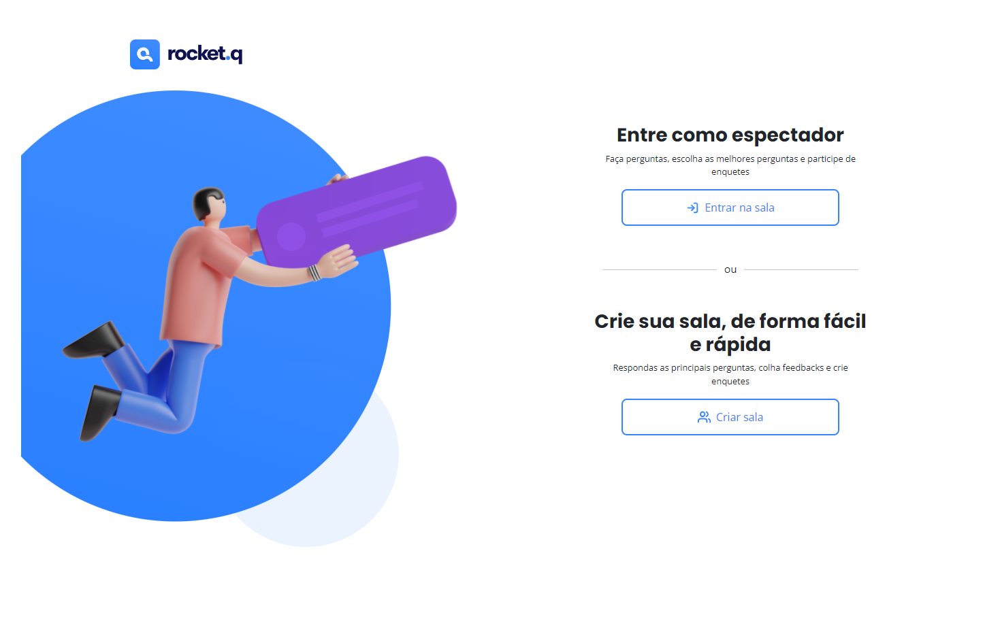
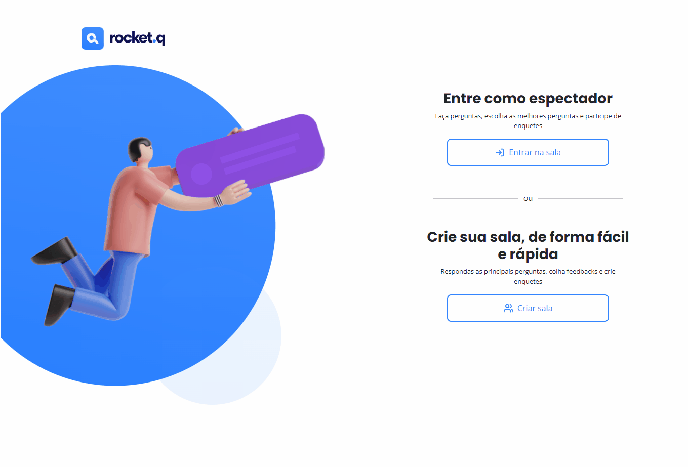
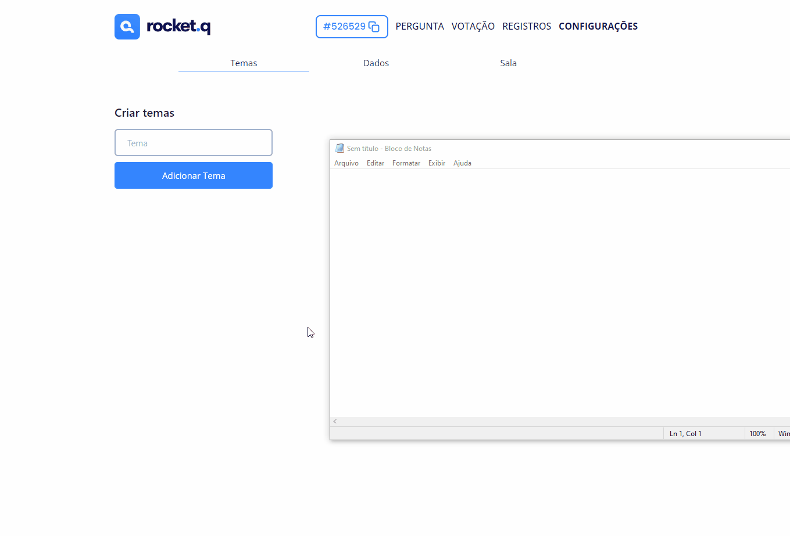
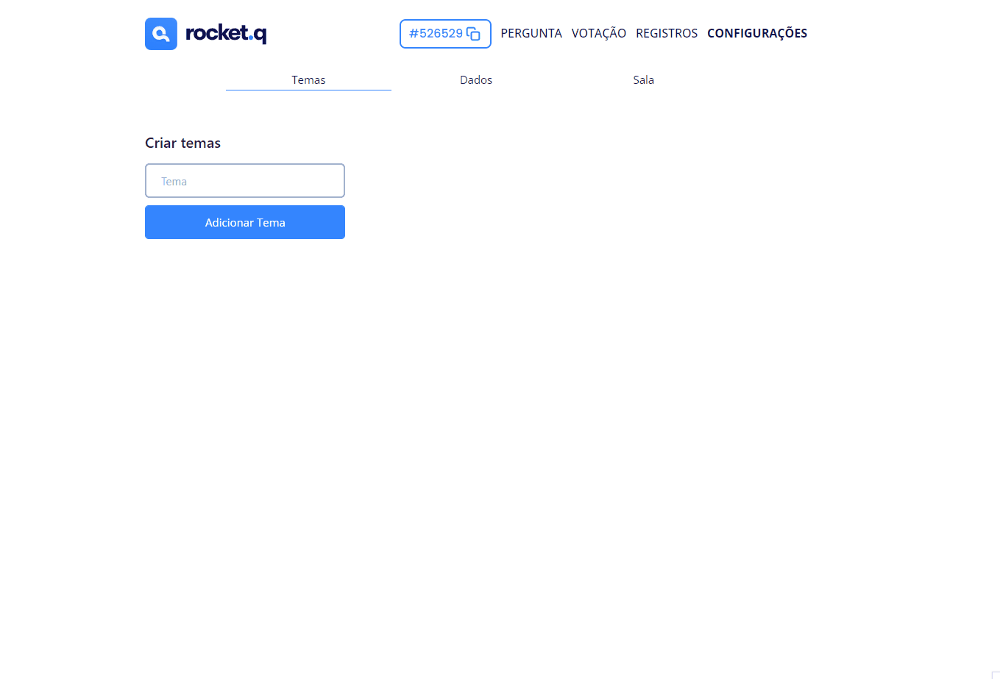
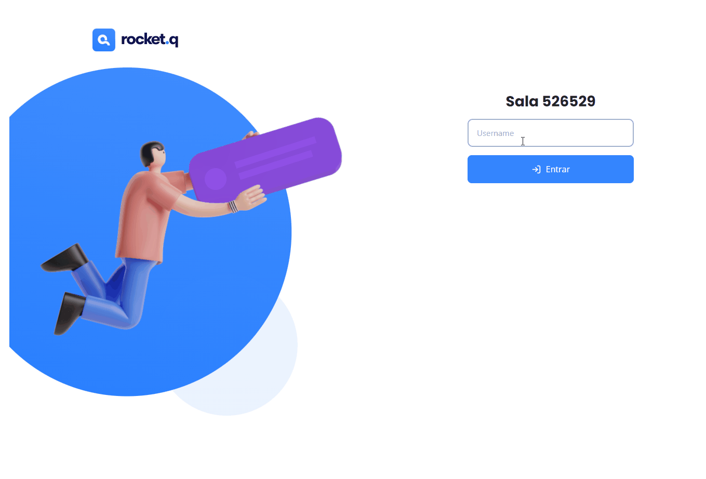
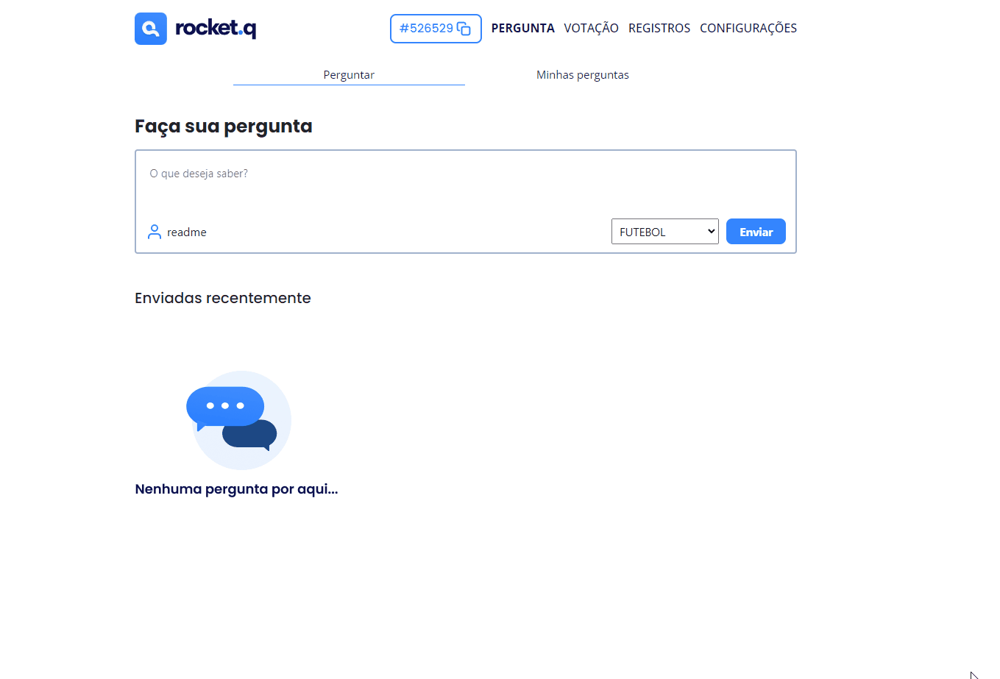
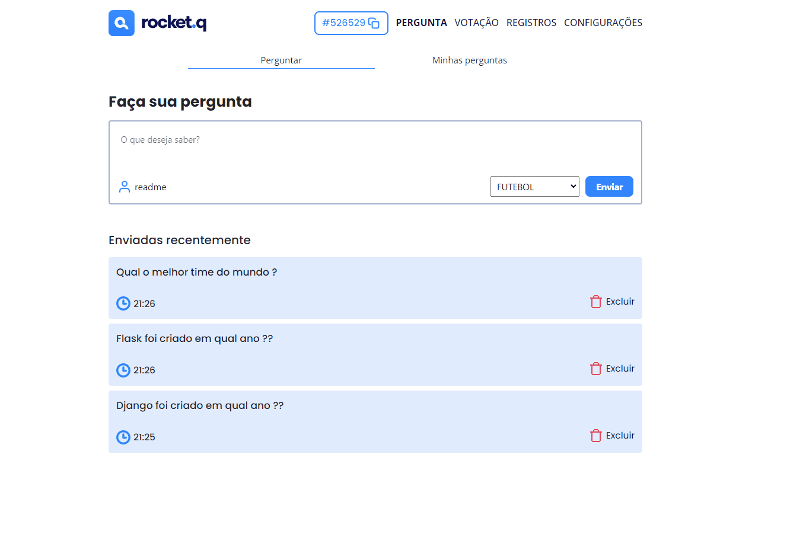

<h1>Roquet.q</h1>

<h2>📖 Sobre</h2>

Meu primeiro projeto usando DRF, este projeto ranqueia perguntas mais desejadas de uma live, assim o streamer pode responder as perguntas mais importantes pelo seu público.

<h2 id="features">🚀 Features</h2>

<ul>
<li>Django messages</li>
<li>Django session</li>
<li>Django ORM</li>
<li>Django signals</li>
<li>Django Rest Framework</li>
<li>Docker</li>
<li>Docker-compose</li>
<li>Admin personalizado</li>
</ul>
 

<h2 id="project">🎥 Projeto</h2>

<h3> - Home Page</h3>

 

<h3> - Criando uma sala</h3>

O código da sala tem sempre 6 dígitos

 

<h3> - Copiando link da sala</h3>

 

<h3> - Criando e desativando temas</h3>

É importante criar o tema logo no início, pois as perguntas só são criadas apartir de um tema

 

<h3> - Entrando na sala</h3>

Você também pode entrar na sala pelo link da home page

 

<h3> - Enviando perguntas</h3>

A pergunta é enviada pelo frontend consumindo a API e criando a pergunta no banco de dados

 

<h3> - Acessando minhas perguntas</h3>

Você pode deletar suas perguntas

 
