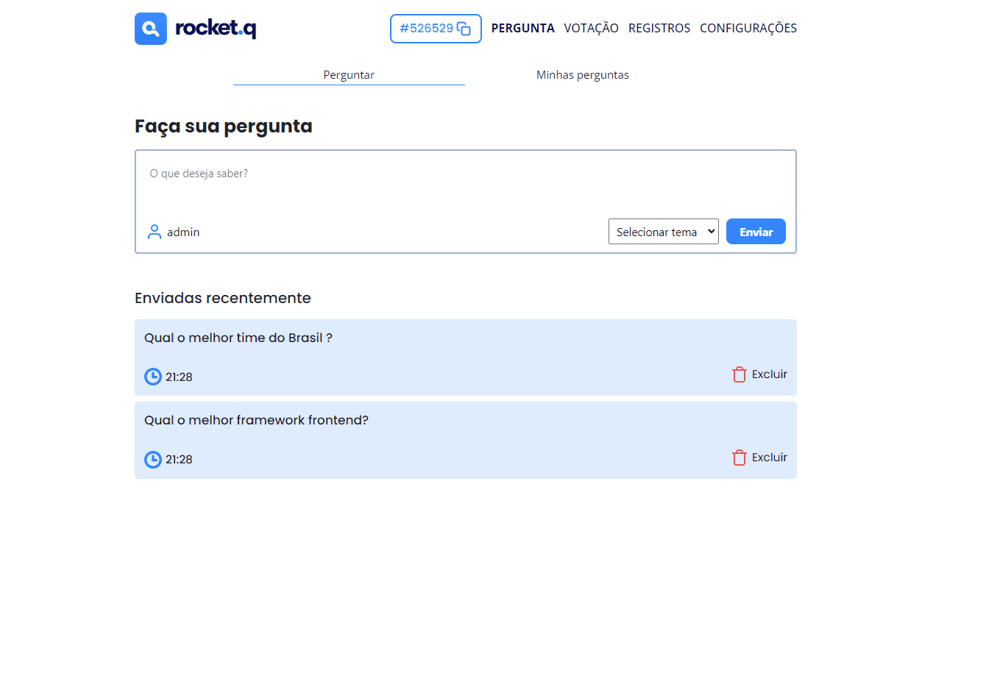
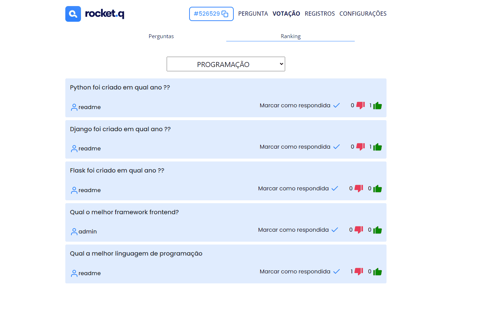
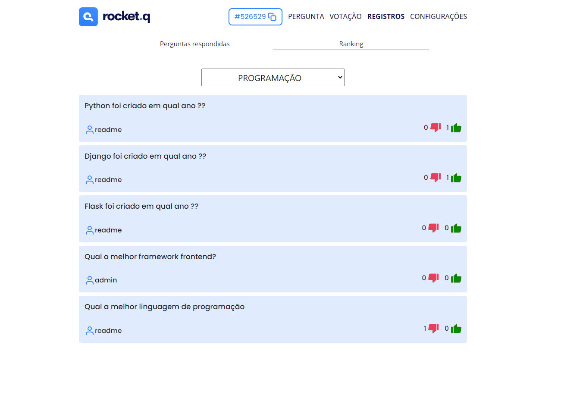
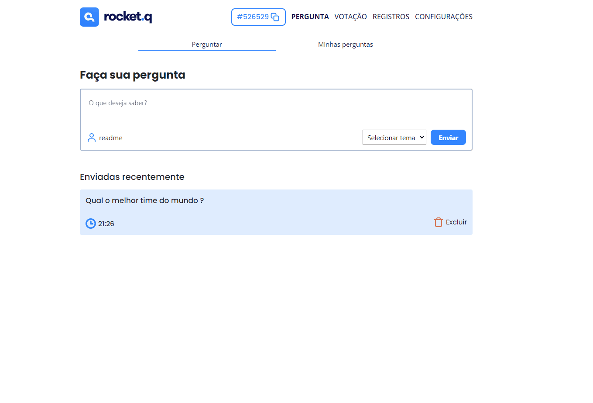

<h1>Roquet.q</h1>

<p align="center">
<a href="#features">Features</a> • 
<a href="#project">Projeto</a> • 
<a href="#how_to_use">Como usar</a>
</p>

<h2>📖 Sobre</h2>

<p>
Meu primeiro projeto usando Django Rest Framework, este projeto ranqueia perguntas mais desejadas de uma live, assim o streamer pode responder as perguntas mais importantes escolhidas pelo seu público.
</p>

<h2 id="features">🚀 Features</h2>

<ul>
<li>Django messages</li>
<li>Django session</li>
<li>Django ORM</li>
<li>Django signals</li>
<li>Django Template tags</li>
<li>Django Rest Framework</li>
<li>Docker</li>
<li>Docker-compose</li>
<li>Admin personalizado</li>
<li>Bootstrap</li>
<li>Testes</li>
</ul>
<br>

<h2 id="project">🎥 Projeto</h2>

<h3> - Home Page</h3>

<br>

<h3> - Criando uma sala</h3>
<p>O código da sala tem sempre 6 dígitos</p>

<br>

<h3> - Copiando link da sala</h3>

<br>

<h3> - Criando e desativando temas</h3>
<p>É importante criar o tema logo no início, pois as perguntas só são criadas apartir de um tema</p>

<br>

<h3> - Entrando na sala</h3>
<p>Você também pode entrar na sala pelo link da home page</p>

<br>

<h3> - Enviando perguntas, com conta readme (inscrito/público)</h3>
<p>A pergunta é enviada pelo frontend consumindo a API e criando a pergunta no banco de dados</p>

<br>

<h3> - Acessando minhas perguntas, com conta readme (inscrito/público)</h3>
<p>Você pode deletar suas perguntas</p>

<br>

<h3> - Votando nas perguntas de temas ativos, usando API, com conta de admin (streamer/admins)</h3>
<p>Você pode votar em qualquer qualquer pergunta que não seja sua</p>

<br>

<h3> - Marcando pergunta como respondida (streamer/admins)</h3>
<p>Sendo admin você pode marcar as perguntas respondidas</p>

<br>

<h3> - Acessando registros</h3>
<p>Depois que um tema fica inativo, qualquer um pode as perguntas que foram respondidas sobre ele, além de ver o ranking final</p>

<br>

<h3> - Acessando configurações</h3>
<p>Contém os dados da sala e dos temas</p>

<br>

<h3> - Restrições de (inscritos/público)</h3>
<p>Não podem marcar perguntas como respondidas e não podem controlar temas</p>

<br>

<h3> - Usuário virando admin/moderador</h3>
<p>Caso o streamer queira ajuda para controlar a live, ele pode passar a senha da sala para outras pessoas. Messagens de error de todas as páginas do site são retornadas por django messages</p>

<br>

<h2 id="how_to_use">🛠️ Como usar</h2>

<p>Para usar você deve ter docker instalado na sua máquina, assim basta apenas rodar o comando abaixo:</p>

```
docker-compose up --build
```

